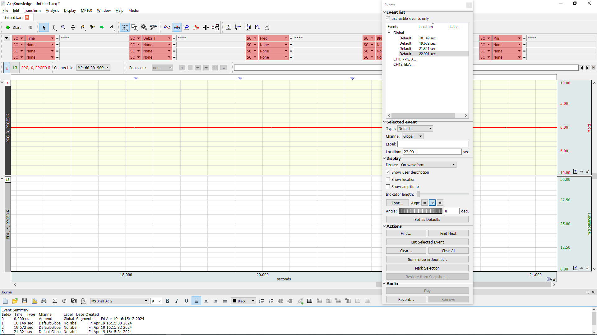
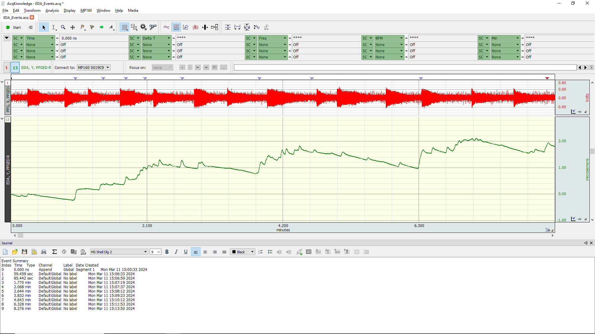
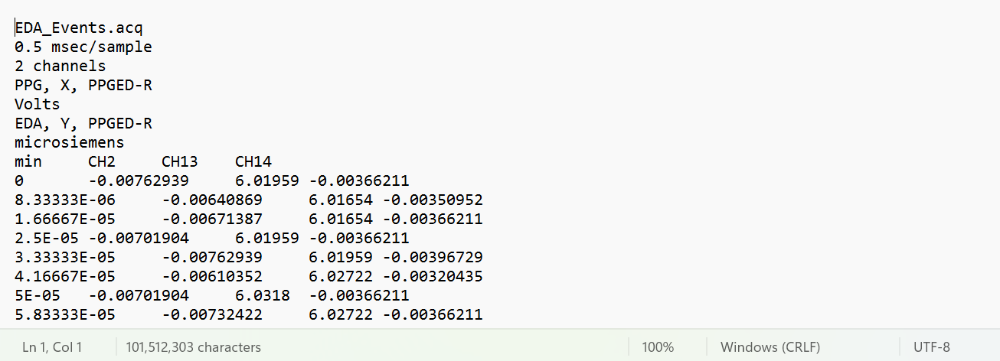

# MDTRC Data Analysis Application

A tool to analyse the EDA data captured using BIOPAC and Acknowledge 5.0 with the various events using various visualizations.

## Requirements - 
  Window 11 

  Python 3.11.9
  
  BIOPAC
  
  Acknowledge 5.0
  
  Resolution compatible - 1920x1080

## On the Acknowledge 5.0 - 

1. If you have already recorded the data, and saved it into the .acq file, Open the file by going to "Open a graph file" -> "Graph file on Disk" and then click Ok and browse the .acq file on the system. 
We will be using "EDA_Events.acq" file for our understanding.

2. After opening the file, the graph for the EDA would be displayed as shown below.

3. You would need two files to run your analysis on the python application which would be generated through Acknowledge 5.0 software - A txt file containing raw dump and .xls file containing the event markers data

4. To generate the txt file, Go to "File" -> "Save As". A dialog box will appear to browse the save location. In the "Save As Type" section select "Text (*.txt, *.csv)". Name the file same as the .acq file, in our case "EDA_Events.txt"

5. When you click Save, a dialog box will appear named "Write text file options". Use the following write options.

6. To generate the .xls file for events, go to "Display" -> "Show" -> "Event Pallette". A dialog box named "Events" would appear.

7.  Click on "Summarize in Journal".

8. A new message would appear titled "No Journal is Open", click on "Yes" to continue. If this doesn't appear an event journal is already opened. 

9. A new dialog box will open named "Event Journal Summary". Use the setting as highlighted below and click "Ok".

10. This would open a journal at the bottom as shown containing a list of events.

If the Journal doesn't open, go to "Display" -> "Show" -> "Journal"

12. On the Journal dialog at the bottom, click on the "Save" button which would open the File browser. 

13. While saving select the "Excel Spreadsheet (.xls)" in "Save as type" and name the file same as the text file, "EDA_Events.xls" in our case. Click on "Save"

14. Now you would have the two generated files named "EDA_Events.txt" and "EDA_Events.xls"

15. The contents of both the files is shown below - 

 

If the header of the text file does not match, replace the following header - 

EDA_Events.acq

0.5 msec/sample

2 channels

PPG, X, PPGED-R

Volts

EDA, Y, PPGED-R

microsiemens

16. Place both the text and xls files in one folder, preferably inside the python application folder named "data".

## Python Application Setup

1. Install Python 3.11.9

2. Activate the python package installer pip, if not done already.

3. Open the terminal and execute the following command to install the required python packages - 
  pip install matplotlib tk numpy scipy pandas customtkinter

4. In the terminal, go to the folder where the code is kept.

5. Run the following command to run the application - 
  python tkinter_application.py

6. Once the application opens, click on "File" -> "Open". Browse the path where both text file and .xls file have been stored which were extracted from the Acknowledge 5.0. Click on the text file to open.

7. For our demonstration, we will be using "EDA_Events.xls" and "EDA_Events.txt" generated which are placed under the "data" folder.

7. The footer of the application would turn from "No file selected" to the file location and the events list would be populated once the data has been successfully loaded.

## Features of the Application 

1. Plot whole data with event markers - The whole of data can be plotted and analyzed by clicking on the "Plot Data" button. The graph titled "Original Data Graph with Event Markers" will be plotted. The various utility tools like zooming and navigating are placed above the same graph.

2. Filtered Data - Two filters have been provided namely "High Low Pass Filter" and "Time Filter". Two input boxes are given to provide the threshold for the filters and checkboxes to select which filters to use while visualization. Tick the appropriate filter and enter the threshold in the following manner - 

After this, click on "Apply Filters" button and the "Filtered Data Graph" will be populated with the filtered data.

3. Events list - The events list contains the list of events with their names for reference.

4. Multiple Event Graph - Multiple events can be superimposed and plotted on the same graph for analysis between events. Tick the required events in the Events list and click on "Plot Selected Events". Doing so would plot each selected event for 3000 msec on the "Multiple Events Graph" plot.

5. Analyze Single Events - Click on "Analyze Single Events" button, this will open another window titled "Single Event Analysis". However many windows can be opened. These windows are created to isolately analyze an event. Enter the event number in the input box provided (refer the Events list), and select the msec left and right cutoff to dispay the graph of the event. After selecting these parameters, click on "Plot event". The various utility tools like zooming and navigating are placed above the same graph.

